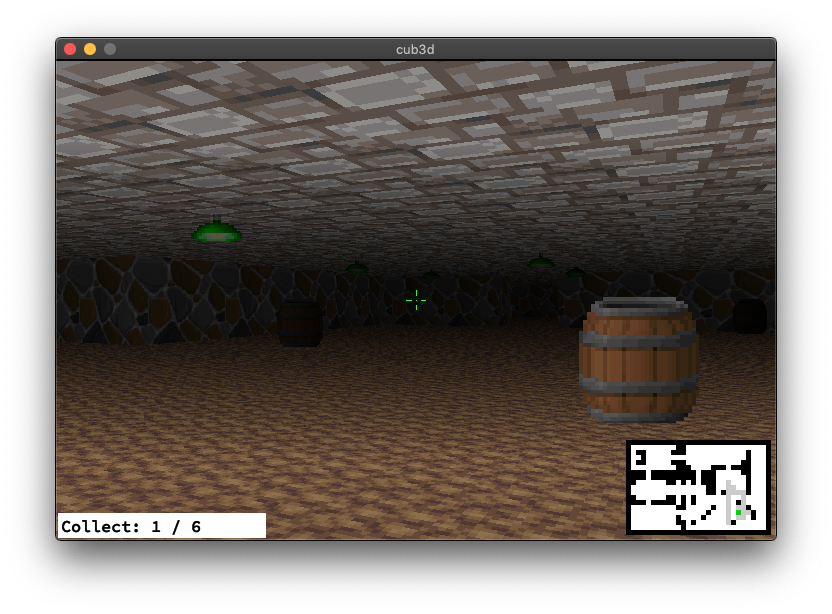

# cub3D

*本プロジェクトは、42カリキュラムの一環として samatsum によって作成されました。*



## 概要 (Description)

cub3Dは、C言語とMinilibX（X11）を用いて構築された、レイキャスティングベースの3Dレンダリングエンジンです。

(Example:  [Wolfenstein 3D](https://fr.wikipedia.org/wiki/Wolfenstein_3D))

### アーキテクチャ (Architecture)

```
                                [ User Input ]
                                      │
                                      ▼
                            Keyboard(WASD, Arrow)
                                      │
┌─────────────────────────────────────▼─────────────────────────────────────┐
│                               Game Engine                                 │
│  ┌─────────────────────────────────────────────────────────────────────┐  │
│  │                            Main Loop (mlx)                          │  │
│  │                                                                     │  │
│  │   ┌───────────────┐     ┌───────────────┐     ┌─────────────────┐   │  │
│  │   │  State Update │────►│   Raycaster   │────►│    Renderer     │   │  │
│  │   │   (Camera)    │     │  (DDA Math)   │     │ (Pixel Buffer)  │   │  │
│  │   └───────────────┘     └───────────────┘     └─────────────────┘   │  │
│  │                                                                     │  │
│  └──────────────────────────────────┬──────────────────────────────────┘  │
│                                     │                                     │
└─────────────────────────────────────▼─────────────────────────────────────┘
                                      │
                                      ▼
                    Window Display (X11) / BMP Export

```

遊び方 (How to Play)
```
make
./cub3D maps/1.cub
```

W, A, S, D: 移動

Q, E または 左右矢印キー: 視点の回転

ESC: ゲームを終了する

(※ IでUI、Oで照準、Lで影の切り替え、スクリーンショットなどの拡張機能も入っています)

## ドキュメント (Documentation)

本プロジェクトの詳細な仕様、検証手順、および内部構造については、対象読者に合わせた以下の専用ドキュメントを参照してください。

* 👉 **[USER_DOC.md](https://www.google.com/search?q=./USER_DOC.md)**
* **対象:** 本システムを操作・検証するエンドユーザーおよび評価者。
* **内容:** 起動要件、基本操作、マップファイルの記述ルール、およびデバッグ用スクリーンショット（`-save`）機能を用いた健全性確認の手順。


* 👉 **[DEV_DOC.md](https://www.google.com/search?q=./DEV_DOC.md)**
* **対象:** 本エンジンの内部仕様を理解し、保守・拡張を行おうとする開発者。
* **内容:** 全体アーキテクチャの詳細、ディレクトリ・モジュール構造、コーディング規約（Norminette準拠）、および将来の拡張ロードマップ。


## 参考資料 (Resources)

* [Playable Wolfenstein 3D](http://users.atw.hu/wolf3d/)
* [Raycasting in JS](http://www.playfuljs.com/a-first-person-engine-in-265-lines/)
* [Some X11 event numbers](https://github.com/qst0/ft_libgfx)
* [Full tutorial in English](https://lodev.org/cgtutor/raycasting.html)
* [Images in minilibx](https://github.com/keuhdall/images_example)
* [BMP format on StackOverflow](https://stackoverflow.com/questions/2654480/writing-bmp-image-in-pure-c-c-without-other-libraries)
* [BMP format explanation](https://web.archive.org/web/20080912171714/http://www.fortunecity.com/skyscraper/windows/364/bmpffrmt.html)
